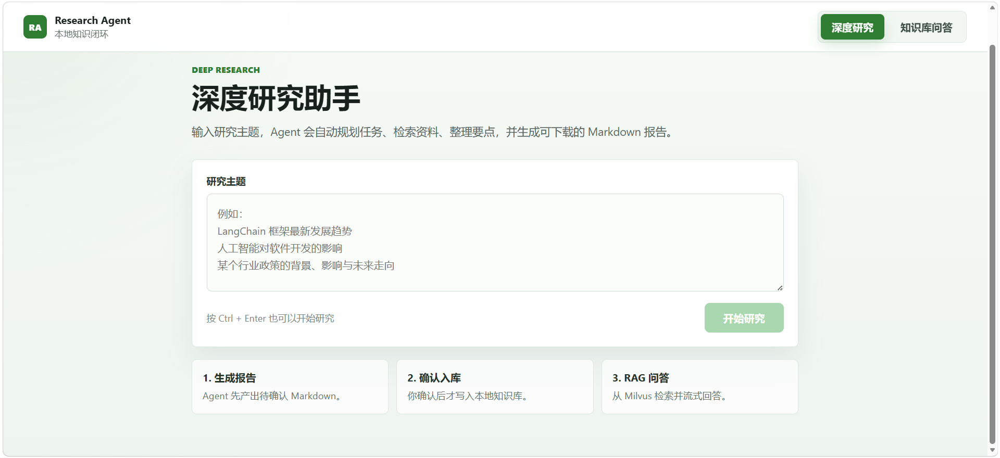
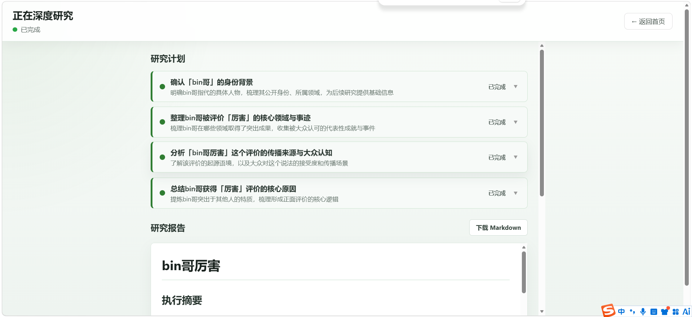
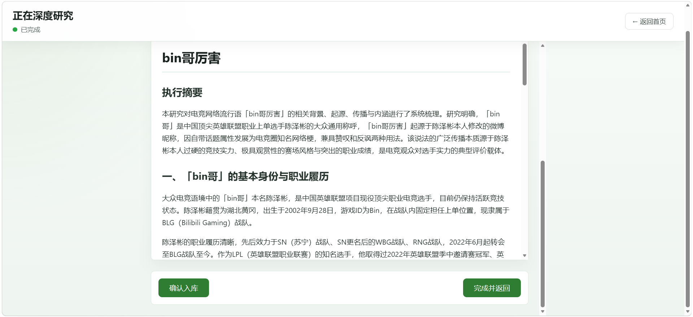
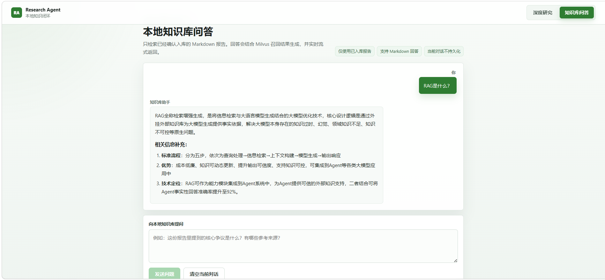

# 自动化深度研究Agent + 本地知识库RAG系统

这是一个面向中文资料研究的多Agent项目。系统支持从用户输入主题开始，自动规划研究任务、检索外部资料、总结信息并生成 Markdown报告；报告生成后不会自动保存到 `backend/data/pending_reports/`，只有用户在前端点击“确认入库”后，才会写入本地Markdown 知识库并增量索引到Milvus，供RAG问答检索使用。

```text
用户输入研究主题
  -> Agent 检索与生成 Markdown 报告
  -> 前端流式展示报告
  -> 用户前端确认入库
  -> 写入 backend/data/markdown
  -> Markdown 结构化切分
  -> dense embedding + Milvus BM25 sparse
  -> Hybrid 检索 + 可选 Rerank
  -> RAG 页面流式回答
```




## 核心功能

- 多Agent深度研究：规划、搜索、总结、报告生成。
- SSE流式输出：研究进度、最终报告、RAG回答均支持前端实时展示。
- 用户确认入库：Agent生成的报告不会自动落盘，用户确认后才进入知识库。
- 本地Markdown 知识库：已确认报告保存到 `backend/data/markdown/`。
- Milvus RAG：使用本地Docker部署的Milvus存储dense/sparse向量。
- Markdown 结构化分块：按一级标题、二级标题、参考来源章节切分。
- Hybrid检索：dense语义召回 + Milvus内置BM25 sparse召回 + RRF融合。
- 元数据过滤：当前支持 `doc_id`、`chunk_type`、`domain`。
- 检索调试日志：每次检索会输出命中信息。
- Markdown渲染：研究报告和 RAG 回答均支持 Markdown渲染。
- 不持久化聊天记录：RAG聊天内容只保存在前端内存中，刷新即清空。

## 技术栈

后端：

- Python 3.10+
- FastAPI
- LangChain / langchain-openai
- Tavily
- pymilvus
- sentence-transformers
- torch

前端：

- Vue 3
- TypeScript
- Vite
- marked.js

向量数据库：

- Milvus本地Docker
- Collection：默认 `research_agent_chunks_v2_d768`，更换 embedding 模型时需要手动配置新的 collection 名称
- Dense embedding：本地模型 `backend/model/nlp_gte_sentence-embedding_chinese-base`
- Sparse/BM25：优先使用 Milvus 内置 BM25 / Function 能力

## 项目结构

```text
research_agent/
├── backend/
│   ├── agents/
│   │   ├── planner.py                 # 研究任务规划 Agent
│   │   ├── summarizer.py              # 子任务总结 Agent
│   │   └── reporter.py                # Markdown 报告生成 Agent
│   ├── services/
│   │   ├── planning_service.py
│   │   ├── search_service.py
│   │   ├── summarization_service.py
│   │   └── reporting_service.py
│   ├── tools/
│   │   └── search_tool.py             # Tavily
│   ├── rag/
│   │   ├── schemas.py                 # RAG 数据模型
│   │   ├── markdown_loader.py         # Markdown 加载
│   │   ├── text_splitter.py           # Markdown 结构化切分
│   │   ├── metadata_extractor.py      # domain 元数据提取
│   │   ├── embeddings.py              # 本地 embedding 加载与维度检测
│   │   ├── milvus_store.py            # Milvus collection / insert / search
│   │   ├── query_analyzer.py          # 查询分析、改写、过滤条件生成
│   │   ├── hybrid_retriever.py        # dense + sparse + RRF 融合检索
│   │   ├── reranker.py                # 可选 rerank
│   │   ├── retrieval_trace.py         # 检索链路日志和调试输出
│   │   ├── indexer.py                 # 文件/目录索引入口
│   │   ├── qa_service.py              # RAG 问答服务
│   │   └── prompts.py                 # RAG Prompt
│   ├── data/
│   │   └── markdown/                  # 知识库 Markdown
│   ├── schemas.py
│   └── config.py
├── frontend/
│   ├── src/
│   │   ├── App.vue
│   │   ├── components/
│   │   │   ├── AppNav.vue
│   │   │   ├── SearchBox.vue
│   │   │   ├── ResearchModal.vue
│   │   │   ├── TodoList.vue
│   │   │   ├── ReportViewer.vue
│   │   │   └── RagChat.vue
│   │   ├── composables/
│   │   │   ├── useResearch.ts
│   │   │   └── useRagChat.ts
│   │   ├── main.ts
│   │   └── style.css
│   └── package.json
├── images/
├── requirements.txt
├── .env
└── README.md
```

## RAG 数据设计

当前Milvus collection名称：

```text
research_agent_chunks_v2_d768
```

如果更换embedding 模型，需要同时修改 `EMBEDDING_MODEL_PATH`、`EMBEDDING_DIM` 和 `MILVUS_COLLECTION`。程序不会删除旧 collection；如果当前配置的 collection 已存在但维度不匹配，会直接报错，要求你手动指定新的collection名称。

Schema：

```text
chunk_uid      VARCHAR primary key
doc_id         VARCHAR
chunk_type     VARCHAR      # title / section / reference
domain         VARCHAR      # 技术 / 金融 / 医疗 / 教育 / 政策 / 产品 / 其他
content        VARCHAR
dense_vector   FLOAT_VECTOR dim=EMBEDDING_DIM
sparse_vector  SPARSE_FLOAT_VECTOR
```

说明：

- `chunk_uid`：chunk唯一 ID。
- `doc_id`：文档归属ID，后续可用于按文档过滤。
- `chunk_type`：区分标题块、正文块、参考来源块。
- `domain`：主题领域，用于基础元数据过滤。
- `content`：保留原始chunk文本，便于调试、引用展示和BM25 sparse检索。
- `dense_vector`：本地 embedding 向量，用于语义召回。当前本地模型实测维度为 `768`，配置值 `EMBEDDING_DIM` 必须与实测维度一致。
- `sparse_vector`：Milvus内置BM25 sparse向量，用于关键词召回。

## Agent与知识库入库流程

1. 用户在前端输入研究主题。
2. 后端启动研究任务，通过SSE推送规划、搜索、总结、报告生成状态。
3. Agent生成Markdown报告。
4. 报告通过SSE流式返回给前端展示，不会自动保存到：

```text
backend/data/pending_reports/
```

5. 前端展示“确认入库”按钮。
6. 用户确认后，报告写入：

```text
backend/data/markdown/
```

7. `RagIndexer`加载该Markdown，结构化切分、提取domain、使用本地 embedding 模型生成dense向量，并写入Milvus。
8. RAG问答页面即可检索该报告内容。

也就是说：没有经过用户确认入库的报告，不会进入Milvus向量数据库。

当前只保留“Agent生成报告 -> 用户确认入库”这一条入库路径，不再暴露全量扫描 `backend/data/markdown/` 的入库接口。

## RAG 检索流程

```text
用户提问
  -> QueryAnalyzer 分析查询
  -> 生成 rewritten_query / expanded_queries / domain / include_references
  -> 构造 Milvus filter expr
  -> dense search
  -> sparse BM25 search
  -> RRF 融合
  -> 可选 rerank
  -> 拼接上下文
  -> 大模型流式生成回答
```

默认配置：

```text
DENSE_TOP_K=20
SPARSE_TOP_K=20
HYBRID_TOP_K=8
RERANK_TOP_K=5
RRF_K=60
ENABLE_RERANK=False
ENABLE_QUERY_REWRITE=True
ENABLE_SPARSE_SEARCH=True
```

`ENABLE_RERANK` 默认关闭，因为 `BAAI/bge-reranker-base` 首次加载会下载较大的模型文件。需要更高检索质量时，可以手动开启。

## 环境准备

### 1. 创建 Python 环境

```bash
conda create -n research python=3.10
conda activate research
```

### 2. 安装后端依赖

```bash
cd research_agent
pip install -r requirements.txt
```

### 3. 安装前端依赖

```bash
cd frontend
npm install
```

### 4. 启动 Milvus

项目要求本地已经通过Docker部署 Milvus，并开放默认端口：

```text
localhost:19530
```

如果你的Milvus地址不同，请在 `.env` 中修改：

```env
MILVUS_HOST=localhost
MILVUS_PORT=19530
MILVUS_COLLECTION=research_agent_chunks_v2_d768
```

### 5. 配置环境变量

在项目根目录创建 `.env`：

```env
# LLM，兼容 OpenAI 格式接口
LLM_API_KEY=your_llm_api_key
LLM_MODEL_ID=your_model_id
LLM_BASE_URL=your_base_url

# 搜索引擎
TAVILY_API_KEY=your_tavily_api_key
SEARCH_ENGINE=tavily

# 如果不使用 Tavily，可切换为 DuckDuckGo
# SEARCH_ENGINE=duckduckgo

# Milvus
MILVUS_HOST=localhost
MILVUS_PORT=19530
MILVUS_COLLECTION=research_agent_chunks_v2_d768

# Embedding
EMBEDDING_MODEL_NAME=nlp_gte_sentence-embedding_chinese-base
EMBEDDING_MODEL_PATH=backend/model/nlp_gte_sentence-embedding_chinese-base
EMBEDDING_DIM=768

# RAG
ENABLE_SPARSE_SEARCH=True
ENABLE_QUERY_REWRITE=True
ENABLE_RERANK=False
```

## 启动项目

### 后端

请先确认FastAPI入口文件存在。旧版项目使用：

```bash
cd research_agent/backend
python main.py
```

也可以使用类似命令：

```bash
uvicorn main:app --host 0.0.0.0 --port 8000 --reload
```

后端默认地址：

```text
http://localhost:8000
```

### 前端

```bash
cd research_agent/frontend
npm run dev
```

前端默认地址：

```text
http://localhost:5173
```

## 日志与调试

RAG 检索会输出较详细日志，便于排查召回质量：

```text
trace_id
original_query
rewritten_query
expanded_queries
filter_expr
dense_hits
sparse_hits
fused_hits
reranked_hits
selected_context
```

如果 RAG 回答不符合预期，建议优先查看：

1. `/api/rag/search` 返回的 `dense_hits` 和 `sparse_hits`。
2. `filter_expr` 是否因为 `domain` 或 `chunk_type` 过滤过严。
3. Milvus collection是否为当前配置的 collection；如果更换 embedding 模型，需要手动指定新的 `MILVUS_COLLECTION`。
4. 已确认入库的 Markdown 是否存在于 `backend/data/markdown/`。

## 后续迭代方向

- 知识库文档列表与删除/重建索引。
- 更细粒度的metadata filter。
- 检索结果引用来源展示。
- 查询改写和多轮检索增强。
- Rerank默认可配置化与模型缓存说明。
- RAG 聊天记录持久化。
